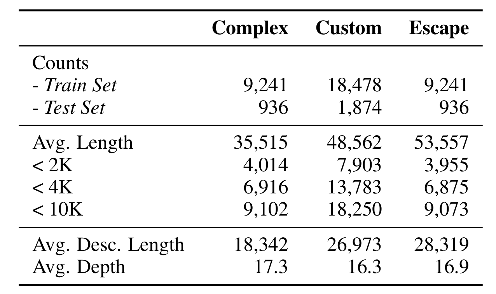
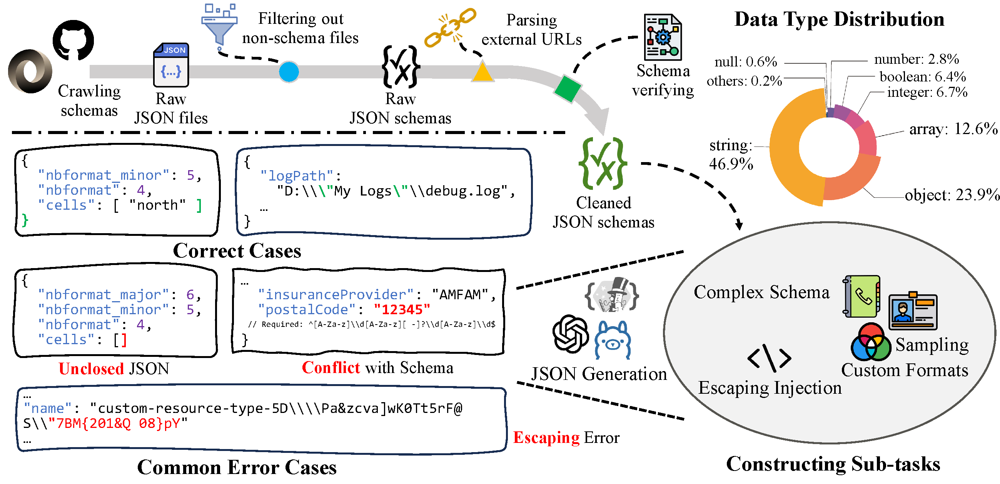
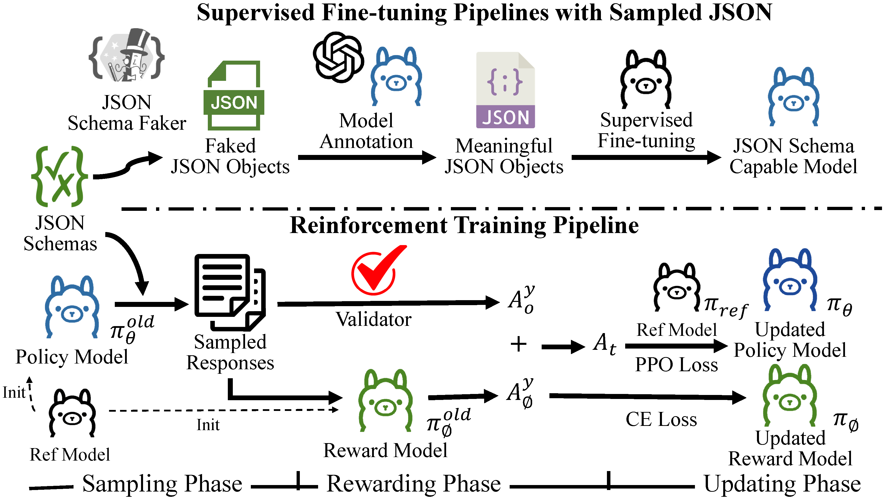

<div align="center">
    <h1> Schema Reinforcement Learning </h1>
</div>

<div align="center">

</div>

<p align="center">
  <a href="#data">Data</a> •
  <a href="#model">Model</a> •
  <a href="#performance">Performance</a> •
  <a href="#training">Training</a> •
  <a href="#evaluation">Evaluation</a> •
  <a href="https://arxiv.org/abs/2502.18878">Paper</a> •
  <a href="#citation">Citation</a>

</p>

</div>

Welcome to the official repo for Schema Reinforcement Learning, containing the dataset, training scripts, and evaluation code in our paper.

## What's New

- **[2025/02/27]** Our paper is now released on arXiv! Check it [here](https://arxiv.org/abs/2502.18878)!
- **[2025/02/26]** SchemaBench is now released!

## Data

SchemaBench is intended solely for research and educational purposes and should not be construed as reflecting the opinions or views of the creators, owners, or contributors of this dataset. Below is the statistics of the schemas used in SchemaBench:

<br>
<div align="center">

</div>
<br>

We crawled 40K+ real-world schema files from [JSON Schema Store](https://www.schemastore.org/json/) and GitHub, and constructed SchemaBench. Below we present our data cleaning and construction pipeline with common cases.

<br>
<div align="center">

</div>
<br>

### Data Release

 Please download our dataset using the following link: [Google Drive](https://drive.google.com/drive/folders/1NOx6xzS30HHRk5rikUdNOXvOT7UtwstR) or [Tsinghua Cloud](https://cloud.tsinghua.edu.cn/d/732f121b7b0044798190/). *Simply copy those data files into the same folders in the repo.*
The file structure is as follows:
```
├── /schemabench/
│  └── /data/
│     ├── /custom/                         // Custom Formats
│     ├── /schema/                         // Complex Schema
│     ├── custom_append.jsonl
│     └── translation_test.jsonl           // Escape Translation
├── /train/
│  └── /data/
│     ├── mix_train_no_collected_json.json // SFT - w/o collected json
│     ├── mix_train.json                   // SFT - w/ collected json
│     ├── train_with_tool_ToS.parquet      // SRL - training set
│     └── val_with_tool_ToS.parquet        // SRL - validation set
```

*Please make sure you have downloaded all data files and put them into the right directory.*

## Model🤗
We release the [LLaMA-3.2 3B SRL](https://huggingface.co/HaolunLi/LLaMA-3.2-3B-SRL) for anyone who wants to use it.

## Performance📈
We evaluate the performance of several models on the SchemaBench. The results are shown below:
<table>
  <thead>
    <tr>
      <th rowspan="2">Model</th>
      <th colspan="4">Schema-only Generation</th>
      <th colspan="4">Schema-constrained Reasoning</th>
    </tr>
    <tr>
      <th>Complex</th>
      <th>Custom</th>
      <th>Escape</th>
      <th>Overall</th>
      <th>GSM8K</th>
      <th>MATH500</th>
      <th>MMLU</th>
      <th>ARC-C</th>
    </tr>
  </thead>
  <tbody>
    <tr>
      <td>GPT-4o</td>
      <td>84.47</td>
      <td>61.56</td>
      <td>37.14</td>
      <td>61.06</td>
      <td>97.80</td>
      <td>41.40</td>
      <td>86.16</td>
      <td>97.01</td>
    </tr>
    <tr>
      <td>GPT-4o-mini</td>
      <td>68.86</td>
      <td>46.17</td>
      <td>16.89</td>
      <td>43.98</td>
      <td>86.13</td>
      <td>31.80</td>
      <td>49.41</td>
      <td>77.65</td>
    </tr>
    <tr>
      <td>Qwen-2.5 7B</td>
      <td>72.42</td>
      <td>43.60</td>
      <td>11.11</td>
      <td>42.38</td>
      <td>94.54</td>
      <td>38.60</td>
      <td>74.43</td>
      <td>91.21</td>
    </tr>
    <tr>
      <td>MiniCPM-3 4B</td>
      <td>53.88</td>
      <td>20.29</td>
      <td>9.13</td>
      <td>27.77</td>
      <td>69.22</td>
      <td>33.40</td>
      <td>66.58</td>
      <td>88.31</td>
    </tr>
    <tr>
      <td>LLaMA-3.1 8B</td>
      <td>64.26</td>
      <td>33.07</td>
      <td>12.02</td>
      <td>36.45</td>
      <td>95.91</td>
      <td>85.60</td>
      <td>71.83</td>
      <td>84.98</td>
    </tr>
    <tr>
      <td>LLaMA-3.1 8B SFT</td>
      <td>74.56</td>
      <td>46.64</td>
      <td>60.58</td>
      <td>60.59</td>
      <td>89.46</td>
      <td>63.80</td>
      <td>66.97</td>
      <td>84.56</td>
    </tr>
    <tr>
      <td>- w/o Collected JSON</td>
      <td>70.84</td>
      <td>42.06</td>
      <td>60.35</td>
      <td>57.75</td>
      <td>78.39</td>
      <td>46.00</td>
      <td>58.87</td>
      <td>75.68</td>
    </tr>
    <tr>
      <td>LLaMA-3.1 8B SRL</td>
      <td>90.48</td>
      <td>78.67</td>
      <td>69.86</td>
      <td>79.67</td>
      <td>90.90</td>
      <td>88.00</td>
      <td>70.74</td>
      <td>84.81</td>
    </tr>
    <tr>
      <td>LLaMA-3.2 3B</td>
      <td>49.84</td>
      <td>27.31</td>
      <td>8.37</td>
      <td>28.51</td>
      <td>80.97</td>
      <td>35.40</td>
      <td>62.38</td>
      <td>79.27</td>
    </tr>
    <tr>
      <td>LLaMA-3.2 3B SFT</td>
      <td>71.71</td>
      <td>45.52</td>
      <td>52.21</td>
      <td>56.48</td>
      <td>82.94</td>
      <td>44.40</td>
      <td>61.50</td>
      <td>78.41</td>
    </tr>
    <tr>
      <td>- w/o Collected JSON</td>
      <td>72.42</td>
      <td>42.83</td>
      <td>54.82</td>
      <td>56.69</td>
      <td>78.85</td>
      <td>36.20</td>
      <td>59.11</td>
      <td>75.68</td>
    </tr>
    <tr>
      <td>LLaMA-3.2 3B SRL</td>
      <td>82.25</td>
      <td>66.13</td>
      <td>69.10</td>
      <td>72.50</td>
      <td>84.23</td>
      <td>43.20</td>
      <td>57.99</td>
      <td>78.24</td>
    </tr>
  </tbody>
</table>

## Training

✨Here is an overview of our training pipeline.

<br>
<div align="center">

</div>
<br>

### Install
Clone this repository and navigate to the SchemaBench folder.
```bash
git clone git@github.com:thunlp/SchemaReinforcementLearning.git
cd SchemaReinforcementLearning
```
Initialize the environment (python==3.11)
```bash
bash scripts/init_env.sh
```

### Data Preparation
Download the data files from the [Data Release](#data) section and put them into the right directory.

### Fine-Tuning
```bash
bash scripts/train_sft.sh
```
If you want to use the SFT data without collected JSON, please run the following command:
```bash
bash scripts/train_sft_no_collected_json.sh
```

### Schema Reinforcement Learning (SRL)
We use [a modified version of PRIME](https://github.com/kekekawaii2839/PRIME) for SRL, which is already included in this repo as a submodule. To train the SRL model, please run the following command:
```bash
bash scripts/train_srl.sh
```

You can find your trained models in the `train/results` directory by default.

## Evaluation
Before evaluating performance on the SchemaBench, you should initialize the config file for local models' inference.
We use [CodeLinker](https://github.com/luyaxi/CodeLinker) for inference, which currently support any OpenAI compatible server for the evaluation. To initialize the config file, first:
```bash
cp private_example.toml private.toml
```
Then fill in the `private.toml` with your api key and base url if needed. After that, you can run the following evaluation script:
```bash
bash scripts/test_schemabench.sh
```

If you need to run the evaluation on a subset of the SchemaBench, you can modify the `test_category` in `test_schemabench.sh` script. Currently you can choose from `['all', 'schema', 'reasoning']` and all single sub-tasks.

## Citation
If you find our work helpful, please consider citing our paper:
```bibtex
@misc{lu2025learninggeneratestructuredoutput,
      title={Learning to Generate Structured Output with Schema Reinforcement Learning}, 
      author={Yaxi Lu and Haolun Li and Xin Cong and Zhong Zhang and Yesai Wu and Yankai Lin and Zhiyuan Liu and Fangming Liu and Maosong Sun},
      year={2025},
      eprint={2502.18878},
      archivePrefix={arXiv},
      primaryClass={cs.CL},
      url={https://arxiv.org/abs/2502.18878}, 
}
```
